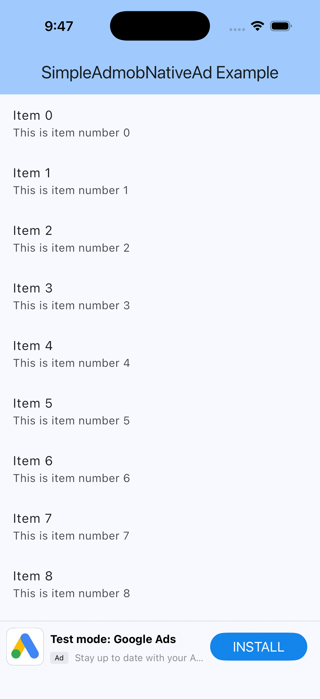
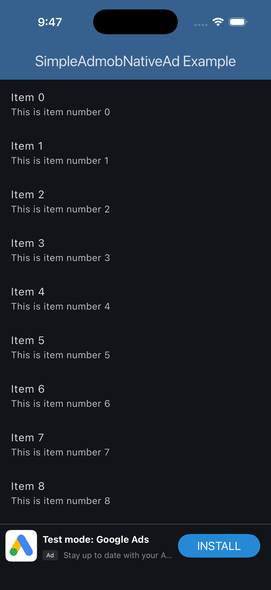
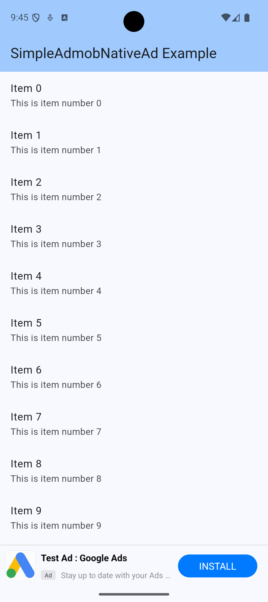
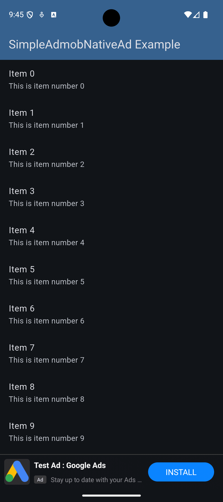

# simple_admob_native_ad

A simple, compact Flutter plugin for displaying Google AdMob native ads as banners with auto-refresh and lifecycle management.

## Features

- ✅ **Native Ad Integration**: Display Google AdMob native ads with custom layouts
- ✅ **Auto-Refresh**: Automatically reload ads every 5 minutes (configurable)
- ✅ **Lifecycle Management**: Pause/resume ad timer based on app lifecycle
- ✅ **Platform Support**: iOS and Android (Web, macOS, Windows, Linux not supported)
- ✅ **Customizable Placeholder**: Show custom widget while ad is loading
- ✅ **Smooth Transitions**: Animated transitions between placeholder and ad

## Screenshots

### iOS

<table>
  <tr>
    <td><br><p align="center">Light Mode</p></td>
    <td><br><p align="center">Dark Mode</p></td>
  </tr>
</table>

### Android

<table>
  <tr>
    <td><br><p align="center">Light Mode</p></td>
    <td><br><p align="center">Dark Mode</p></td>
  </tr>
</table>

## Installation

Add this to your package's `pubspec.yaml` file:

```yaml
dependencies:
  simple_admob_native_ad: ^1.0.0
  google_mobile_ads: ^6.0.0
```

## Setup

### Android

1. **Add AdMob App ID** to `android/app/src/main/AndroidManifest.xml`:

```xml
<manifest>
    <application>
        <meta-data
            android:name="com.google.android.gms.ads.APPLICATION_ID"
            android:value="ca-app-pub-xxxxxxxxxxxxxxxx~yyyyyyyyyy"/>
    </application>
</manifest>
```

> **Note**: For testing, use the test app ID: `ca-app-pub-3940256099942544~3347511713`

**That's it!** The native ad factory is automatically registered by the plugin on Android—no additional code needed in your app.

### iOS

1. **Add AdMob App ID** to `ios/Runner/Info.plist`:

```xml
<key>GADApplicationIdentifier</key>
<string>ca-app-pub-xxxxxxxxxxxxxxxx~yyyyyyyyyy</string>
<key>SKAdNetworkItems</key>
<array>
    <dict>
        <key>SKAdNetworkIdentifier</key>
        <string>cstr6suwn9.skadnetwork</string>
    </dict>
</array>
```

> **Note**: For testing, use the test app ID: `ca-app-pub-3940256099942544~1458002511`

2. **Register SimpleNativeAdFactory** in your `ios/Runner/AppDelegate.swift`:

> **Why is this step required on iOS?** Unlike Android, iOS requires manual registration in AppDelegate because the `FLTGoogleMobileAdsPlugin.registerNativeAdFactory` method needs access to `FlutterPluginRegistry` (which only AppDelegate provides). This is a platform limitation, not specific to this plugin.

```swift
import UIKit
import Flutter
import simple_admob_native_ad

@main
@objc class AppDelegate: FlutterAppDelegate {
  override func application(
    _ application: UIApplication,
    didFinishLaunchingWithOptions launchOptions: [UIApplication.LaunchOptionsKey: Any]?
  ) -> Bool {
    GeneratedPluginRegistrant.register(with: self)
    SimpleAdmobNativeAdPlugin.registerNativeAdFactory(registry: self)
    return super.application(application, didFinishLaunchingWithOptions: launchOptions)
  }
}
```

> **That's it!** Just one line of code (`SimpleAdmobNativeAdPlugin.registerNativeAdFactory(registry: self)`) handles all the registration.

3. **(Optional) Disable Native Ad Validator during development** in `ios/Runner/Info.plist`:

By default, the Native Ad Validator is enabled in debug builds to help you validate your ad layout. If you want to disable the validator overlay during development, add the following to your Info.plist:

```xml
<key>GADNativeAdValidatorEnabled</key>
<false/>
```

> **Note**: The validator is only shown in debug builds and is automatically disabled in release builds. It's recommended to keep it enabled during development to ensure your ad layout is correctly implemented.

## Usage

### Basic Example

```dart
import 'package:flutter/material.dart';
import 'package:simple_admob_native_ad/simple_admob_native_ad.dart';
import 'package:google_mobile_ads/google_mobile_ads.dart';

void main() {
  WidgetsFlutterBinding.ensureInitialized();
  MobileAds.instance.initialize();
  runApp(const MyApp());
}

class MyApp extends StatelessWidget {
  const MyApp({super.key});

  @override
  Widget build(BuildContext context) {
    return MaterialApp(
      title: 'SimpleAdmobNativeAd Example',
      theme: ThemeData(
        colorScheme: ColorScheme.fromSeed(seedColor: Colors.blue),
        useMaterial3: true,
      ),
      home: const MyHomePage(),
    );
  }
}

class MyHomePage extends StatefulWidget {
  const MyHomePage({super.key});

  @override
  State<MyHomePage> createState() => _MyHomePageState();
}

class _MyHomePageState extends State<MyHomePage> {
  final _timerController = SimpleNativeAdTimerController();

  @override
  void dispose() {
    _timerController.stopTimer?.call();
    super.dispose();
  }

  @override
  Widget build(BuildContext context) {
    return Scaffold(
      appBar: AppBar(
        backgroundColor: Theme.of(context).colorScheme.inversePrimary,
        title: const Text('SimpleAdmobNativeAd Example'),
      ),
      body: Column(
        children: [
          Expanded(
            child: ListView.builder(
              itemCount: 20,
              itemBuilder: (context, index) {
                return ListTile(
                  title: Text('Item $index'),
                  subtitle: Text('This is item number $index'),
                );
              },
            ),
          ),
          SafeArea(
            child: SimpleNativeAd(
              iosAdUnitId: testNativeAdUnitIdIOS,
              androidAdUnitId: testNativeAdUnitIdAndroid,
              timerController: _timerController,
              showBorderTop: true,
            ),
          ),
        ],
      ),
    );
  }
}
```

### Test Ad Unit IDs

For testing, use the following ad unit IDs from `ad_util.dart`:

```dart
// iOS Test Ad Unit IDs
testNativeAdvancedAdUnitIdIOS: 'ca-app-pub-3940256099942544/3986624511'

// Android Test Ad Unit IDs
testNativeAdvancedAdUnitIdAndroid: 'ca-app-pub-3940256099942544/2247696110'
```

**Important**: Replace with your actual ad unit IDs before releasing to production!

## Parameters

| Parameter | Type | Required | Default | Description |
|-----------|------|----------|---------|-------------|
| `iosAdUnitId` | String | Yes | - | AdMob ad unit ID for iOS |
| `androidAdUnitId` | String | Yes | - | AdMob ad unit ID for Android |
| `timerController` | SimpleNativeAdTimerController | Yes | - | Controller to manage ad refresh timer |
| `placeholder` | Widget? | No | null | Widget to display while ad is loading |
| `height` | double? | No | Auto (90.0 for iPad, 64.0 for iPhone) | Height of the ad banner in pixels |
| `refreshInterval` | Duration | No | 5 minutes | How often to reload the ad |
| `animationDuration` | Duration | No | 300 milliseconds | Duration of transition animation between placeholder and ad |
| `onAdLoaded` | VoidCallback? | No | null | Callback when ad is loaded successfully |
| `onAdFailedToLoad` | VoidCallback? | No | null | Callback when ad fails to load |
| `showBorderTop` | bool | No | false | Whether to show top border |
| `borderTopWidth` | double | No | 1.0 | Width of top border |
| `borderTopColor` | Color? | No | Theme-based | Color of top border |
| `showBorderBottom` | bool | No | false | Whether to show bottom border |
| `borderBottomWidth` | double | No | 1.0 | Width of bottom border |
| `borderBottomColor` | Color? | No | Theme-based | Color of bottom border |
| `forceColorMode` | AdColorMode | No | AdColorMode.auto | Force light/dark mode colors (auto, light, or dark) |
| `backgroundColor` | Color? | No | Theme-based | Background color of ad banner (use Colors.transparent for transparent) |

## Timer Controller

The `SimpleNativeAdTimerController` allows you to control the ad refresh timer:

```dart
final timerController = SimpleNativeAdTimerController();

// Start timer (called automatically)
timerController.startTimer?.call();

// Stop timer (call in dispose())
timerController.stopTimer?.call();
```

## Customization Examples

### Custom Height and Refresh Interval

```dart
SimpleNativeAd(
  iosAdUnitId: 'ca-app-pub-3940256099942544/3986624511',
  androidAdUnitId: 'ca-app-pub-3940256099942544/2247696110',
  timerController: _timerController,
  height: 80.0, // Custom height
  refreshInterval: const Duration(minutes: 5), // Refresh every 5 minutes
  animationDuration: const Duration(milliseconds: 300), // Faster animation
  placeholder: Container(
    color: Colors.grey[200],
    child: const Center(child: Text('Loading ad...')),
  ),
)
```

### Force Light or Dark Mode

You can override the system theme and force the ad to display in light or dark mode:

```dart
// Always show light mode colors
SimpleNativeAd(
  iosAdUnitId: testNativeAdUnitIdIOS,
  androidAdUnitId: testNativeAdUnitIdAndroid,
  timerController: _timerController,
  forceColorMode: AdColorMode.light,
)

// Always show dark mode colors
SimpleNativeAd(
  iosAdUnitId: testNativeAdUnitIdIOS,
  androidAdUnitId: testNativeAdUnitIdAndroid,
  timerController: _timerController,
  forceColorMode: AdColorMode.dark,
)

// Auto (default): Follow system theme
SimpleNativeAd(
  iosAdUnitId: testNativeAdUnitIdIOS,
  androidAdUnitId: testNativeAdUnitIdAndroid,
  timerController: _timerController,
  forceColorMode: AdColorMode.auto, // or omit this parameter
)
```

**Note**: When `forceColorMode` changes, the ad will automatically reload with the new color scheme applied.

### Custom Background Color

You can customize the background color of the ad banner:

```dart
// Transparent background
SimpleNativeAd(
  iosAdUnitId: testNativeAdUnitIdIOS,
  androidAdUnitId: testNativeAdUnitIdAndroid,
  timerController: _timerController,
  backgroundColor: Colors.transparent,
)

// Custom color
SimpleNativeAd(
  iosAdUnitId: testNativeAdUnitIdIOS,
  androidAdUnitId: testNativeAdUnitIdAndroid,
  timerController: _timerController,
  backgroundColor: Colors.grey.shade100,
)

// Default: Automatically uses theme-based color (white for light mode, dark gray for dark mode)
SimpleNativeAd(
  iosAdUnitId: testNativeAdUnitIdIOS,
  androidAdUnitId: testNativeAdUnitIdAndroid,
  timerController: _timerController,
  // backgroundColor omitted - uses default
)
```

### Customizing Ad Layout

#### Android

Edit `android/src/main/res/layout/simple_native_ad.xml` to customize the ad layout.

Customize colors in `android/src/main/res/values/colors.xml`:

```xml
<color name="ad_banner_background">#FFFFFF</color>
<color name="ad_banner_default_text">#000000</color>
<color name="ad_banner_cta_text">#007afe</color>
```

#### iOS

Edit `ios/Classes/NativeAd/SimpleNativeAd.xib` in Xcode Interface Builder to customize the ad layout.

## Platform Support

| Platform | Supported |
|----------|-----------|
| Android | ✅ |
| iOS | ✅ |
| Web | ❌ |
| macOS | ❌ |
| Windows | ❌ |
| Linux | ❌ |

## Requirements

- Flutter: >= 3.3.0
- Dart: >= 3.10.0
- google_mobile_ads: ^5.2.0

## License

MIT License

## Contributing

Contributions are welcome! Please feel free to submit a Pull Request.

## Issues

If you encounter any issues, please file them on the GitHub issue tracker.
